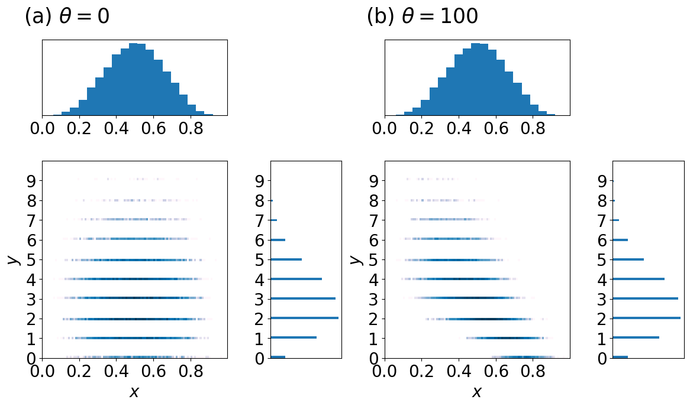
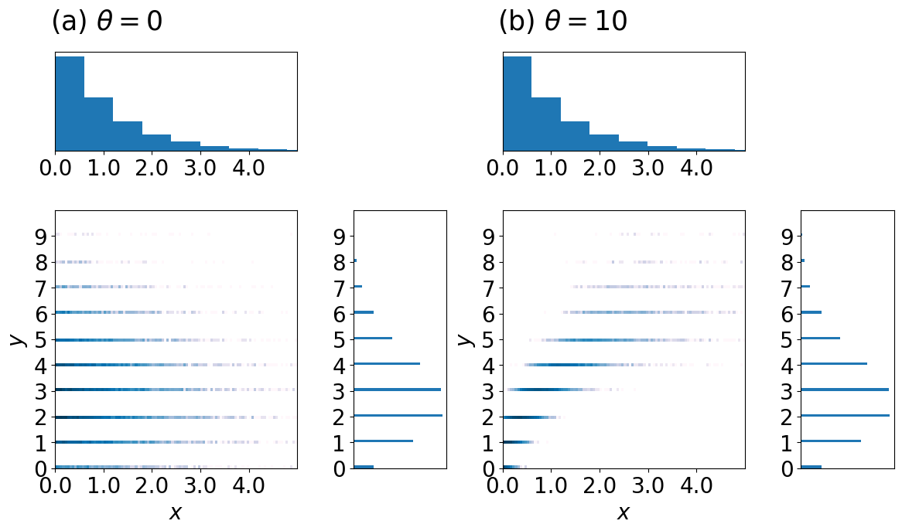
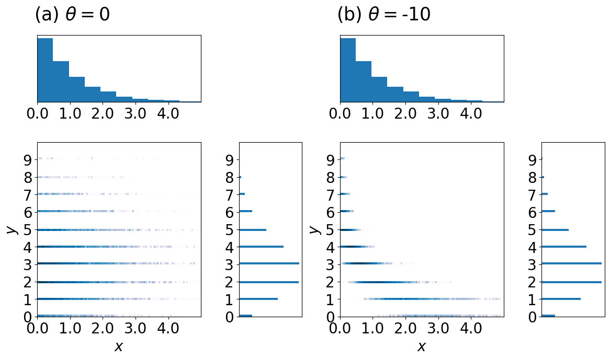
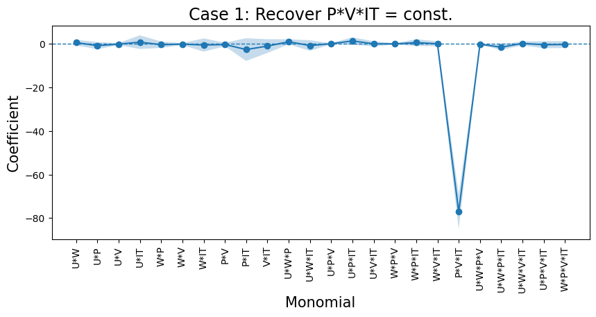
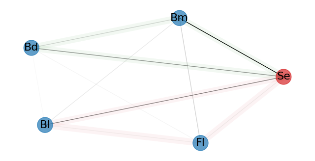
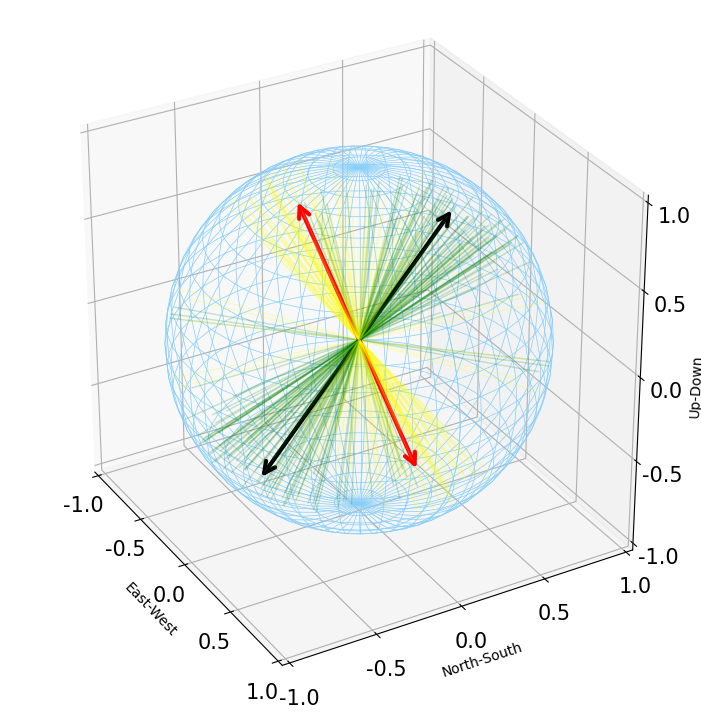

# Minimum information dependence modeling

(Written by Tomonari Sei and Keisuke Yano)

This repository provides R and Python code for the minimum information dependence model developed in the following paper:

Tomonari Sei and Keisuke Yano, [Minimum information dependence modeling](https://projecteuclid.org/journals/bernoulli/volume-30/issue-4/Minimum-information-dependence-modeling/10.3150/23-BEJ1687.full), *Bernoulli*, 30, 2623–2643, 2024. DOI: 10.3150/23-BEJ1687; arXiv:2206.06792.

**Authors:** Tomonari Sei (The University of Tokyo) and Keisuke Yano (The Institute of Statistical Mathematics)

**Abstract:** We propose a method of constructing a joint statistical model for mixed-domain data to analyze their dependence. Multivariate Gaussian and log-linear models are particular examples of the proposed model. It is shown that the functional equation defining the model has a unique solution under fairly weak conditions. The model is characterized by two orthogonal sets of parameters: the dependence parameter and the marginal parameter. To estimate the dependence parameter, a conditional inference together with a sampling procedure is established and is shown to provide a consistent estimator of the dependence parameter. Illustrative examples of data analyses involving penguins and earthquakes are presented.

# Codes

- `mindemo_v4.py`: functions used in Python, including MCMC sampling, full-batch and SGD-based pseudo-likelihood estimation (PLE), bootstrap inference, multicore bootstrap, Benjamini--Hochberg q-values, forest plots, asymptotic covariance estimation, and conditional likelihood estimation (CLE).
- `introduction_v4.ipynb`: introductory Python notebook with three examples described below.
- `min-info.R`: functions used in R.
- `Mechsol_format.csv`: processed mechanism-solution catalog used in the earthquake example. The original catalog is available from the Japan Meteorological Agency.
- The `R` and `Python` folders contain the corresponding example code.

## Python notebook examples

The introductory notebook demonstrates the following three cases:

1. **Hidden ideal gas law:** synthetic data are used to detect the invariant relation `P*V*IT = nR`, where `IT = 1/T`, among second-, third-, and fourth-order candidate interactions.
2. **Penguins:** Adelie penguin data from `palmerpenguins` are used to estimate pairwise and three-way dependencies among four continuous measurements and sex.
3. **Earthquake catalog:** earthquake mechanism solutions and depth are used to estimate P-axis directions that are positively or negatively associated with depth.

The notebook primarily uses SGD-based PLE with Adam for the initial estimate, followed by bootstrap inference with Ruppert–Polyak–Juditsky averaging. Both sequential and multicore bootstrap implementations are provided. Bootstrap summaries include confidence intervals, p-values, Benjamini–Hochberg q-values, and forest plots.

## Running the Python notebook

1. Install the required packages and place `mindemo_v4.py` in the notebook's working directory.
2. For the earthquake example, also place `Mechsol_format.csv` in the same directory.
3. In Google Colab, mount Google Drive and update `your_workingdir` before importing `mindemo_v4`.

Bootstrap cells can be computationally intensive. A small value such as `B=10` is suitable for an initial test; the notebook uses `B=200` for its full examples.

# Dependencies

- R: `palmerpenguins` 0.1.1
- Python: `numpy`, `pandas`, `matplotlib`, `scipy`, `scikit-learn`, `networkx`, and `palmerpenguins`

# Brief summary of the minimum information dependence model

## 1. Minimum information dependence model

The minimum information dependence model is a joint model for mixed-domain data proposed by Sei and Yano:

$$
p(x; \theta, \nu)
= \exp\left(
\theta^{\top}h(x)
- \sum_{j=1}^{d} a_j(x_j;\theta,\nu)
- \psi(\theta,\nu)
\right)
\prod_{j=1}^{d} r_j(x_j;\nu).
$$

The functions $a_j(x_j;\theta,\nu)$ and $\psi(\theta,\nu)$ are determined by the marginal conditions

$$
\int p(x;\theta,\nu)\,dx_{-j}=r_j(x_j;\nu)
$$

and the identifiability condition

$$
\int \sum_{j=1}^{d} a_j(x_j;\theta,\nu)p(x;\theta,\nu)\,dx=0.
$$

The model has the following properties:

- It accommodates variables on different domains, including continuous, categorical, and manifold-valued variables.
- It accommodates various dependence structures, including higher-order and negative interactions.
- The parameters $\theta$ and $\nu$ describe the dependence structure and marginal distributions, respectively.

### Gallery of the minimum information dependence model

**A. Poisson and Beta marginals with a negative interaction**

**B. Exponential and Poisson marginals with a positive interaction**

**C. Exponential and Poisson marginals with a negative interaction**

Interactive three-dimensional examples are also available at <https://github.com/tanaken-basis/mindemo3d>.

## 2. Inference

There are two options for inference on the dependence parameter $\theta$:

- Conditional likelihood estimation (CLE)
- Besag's pseudo-likelihood estimation (PLE)

CLE generally has better statistical performance but is computationally expensive. PLE is computationally less expensive, and the Python implementation provides an SGD-based option and bootstrap uncertainty evaluation.

### Gallery of inference results

#### A. Recovery of the hidden ideal gas relation from synthetic data

- We apply our model to synthetic data consisting of pressure (P), volume (V), inverse temperature (IT=1/T), and two unrelated noise variables (U) and (W).
    
- The data are generated to satisfy the ideal gas relation (P \times V \times IT = nR), up to measurement noise.
    
- The candidate canonical statistics include second-, third-, and fourth-order interaction terms.
    
- The inference results recover (P \times V \times IT) as the prominent dependence structure underlying the observed data.

#### B. Graphical model for continuous and categorical penguin data

- The model is applied to Palmer Archipelago penguin data.
- Red nodes indicate categorical variables, and blue nodes indicate continuous variables.
- Highlighted triangles indicate leading three-way interaction candidates.
- The figure is created with NetworkX in Python.

#### C. Dependence between earthquake mechanism solutions and depth

- The model is applied to the Japan Meteorological Agency earthquake catalog.
- The red axis indicates the P-axis direction with the strongest positive association with depth.
- The black axis indicates the P-axis direction with the strongest negative association with depth.
- Yellow and green axes represent bootstrap uncertainty for the red and black axes, respectively.

## References

- A. Horst, A. Hill, and K. Gorman (2020). *palmerpenguins: Palmer Archipelago (Antarctica) penguin data*. R package version 0.1.0. <https://allisonhorst.github.io/palmerpenguins/>. DOI: 10.5281/zenodo.3960218.
- Japan Meteorological Agency (2022). *The Seismological Bulletin of Japan*. <https://www.data.jma.go.jp/svd/eqev/data/bulletin/index_e.html>.
