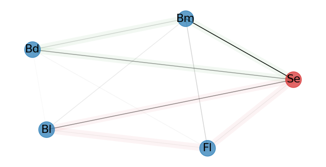

# Minimum information dependence modeling

(Written by Tomonari Sei and Keisuke Yano)

This pape provides R and python codes for minimum information dependence models developed in the following paper:

==========================================================================

Paper inforation: arXiv:2206.06792

Title: Minimum information dependence modeling

Authors: Tomonari Sei (The university of Tokyo), Keisuke Yano (The institute of statistical mathematis)

Abstract: We propose a method of constructing a joint statistical model for mixed-domain data to analyze their dependence. Multivariate Gaussian and log-linear models are particular examples of the proposed model. It is shown that the functional equation defining the model has a unique solution under fairly weak conditions. The model is characterized by two orthogonal sets of parameters: the dependence parameter and the marginal parameter. To estimate the dependence parameter, a conditional inference together with a sampling procedure is established and is shown to provide a consistent estimator of the dependence parameter. Illustrative examples of data analyses involving penguins and earthquakes are presented.

==========================================================================

# Codes 

- min-info.R : definition of the functions used in R
- min-info.py : definition of the functions used in Python
- R folder: R codes 
- Python folder: Python codes
- Each folder contains introductory codes
- Each folder contains Mechsol_format.csv: Mechanism solution catalog (The original catalog is in the web page of Japan Meteological Agency and processed by the authors.)

# Dependencies

- R: 
- Python: 

# Brief summary of the minimum information dependence model

## 1. Minimum information dependence model

The minimum information dependence model is a joint model for a mixed-domain data proposed by Sei and Yano, Minimum information dependence modeling:

$p(x; \theta, \nu)=\exp(\theta^{\top}h(x)-\sum_{j=1,\ldots,d}a_{j}(x_j;\theta,\nu)-\psi(\theta,\nu))\prod_{j=1,\ldots,d}r_{j}(x_{j};\nu)$

such that $a_{j}(x_j;\theta,\nu)$ and $\psi(\theta,\nu)$ are determined by mariginal condition $\int p(x;\theta,\nu)dx_{-j}=r_{j}(x_{j};\nu)$ and identifiability condition $\int \sum_{j=1,\ldots,d} a_{j}(x_{j};\theta,\nu) p(x;\theta,\nu)dx=0$.

Here are the properties of the model:

* The model admits various types of the domains of variables (say, continuou/categorical/manifold/etc...) 
* The model admits various types of dependence (higher-order interaction/negative interaction/etc...)
* Two parameters $\theta$ and $\nu$ are parameters on the joint part (dependence parameter) and the marginal part (marginal parameter), respectively.

### Gallery of the minimum information dependence model:

* A. (count & interval) Poisson and Beta marginals with a negative interaction

* B. (positive number & count) Exponential and Poisson marginals with a positive interaction

* C. (positive number & count) Exponential and Poisson marginals with a negative interaction

## 2. Inference 

There are two options for the inference on $\theta$ (dependence parameter):
* Conditional likelihood estimation (CLE)
* Besag' pseudo likelihood estimation (PLE)

Generally, CLE has better statistical performance but is computationally expensive.
In contrast, PLE offers a less powerful version at a lower computation cost.

Our codes implement both estimation schemes as well as the uncertainty evaluation methods.

### Gallery of the inference based on the minimum information dependence model

#### A. Graphical model of continuous and categorical data with the consideration of the second-order interactions

- We apply our model to Palmer Archipelago penguin data.

- Red nodes indicate categorical variables; Blue nodes indicate continuous variables.

- Red and green cycles indicate the top-2 second-order interationcs.

- The figure is created by using NetworkX in Python.

 
#### B. Dependence pattern of the mechanism solutions (2-orthogonal frames) and the depths (real values)

- We apply our model to the Japan meteorological agency catalog of earthquakes.

- Red axis indicate the axis along which the P-axes of the mechanism solutions has the highest positive dependence to the depths.

- Black axis indicate the axis along which the P-axes of the mechanism solutions has the highest ngative dependence to the depths.

- Yellow and green axes indicate their uncertainty of the estimation, respectively.

## References:
-  A. Horst, A. Hill, K. Gorman (2020). palmerpenguins: Palmer Archipelago (Antarctica) penguin data. R package version 0.1.0. https://allisonhorst.github.io/palmerpenguins/. doi: 10.5281/zenodo.3960218.
-  JAPAN METEOROLOGICAL AGENCY (2022). The seismological bulletin of Japan. https://www.data.jma.go.jp/svd/eqev/data/bulletin/index_e.html.
